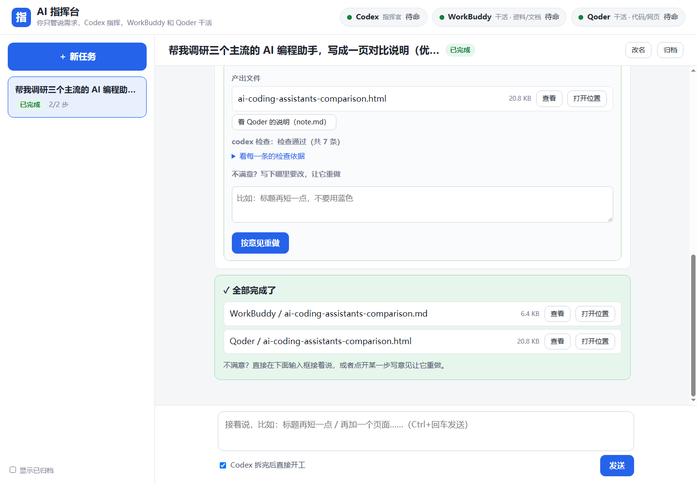
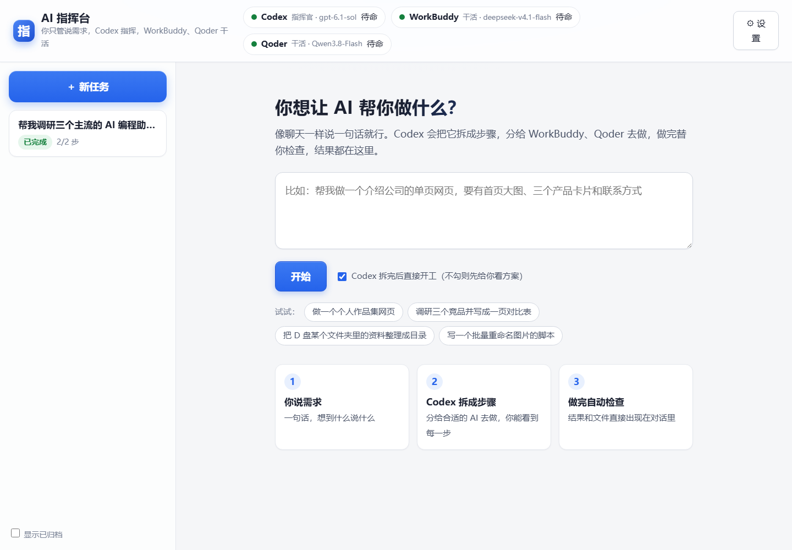
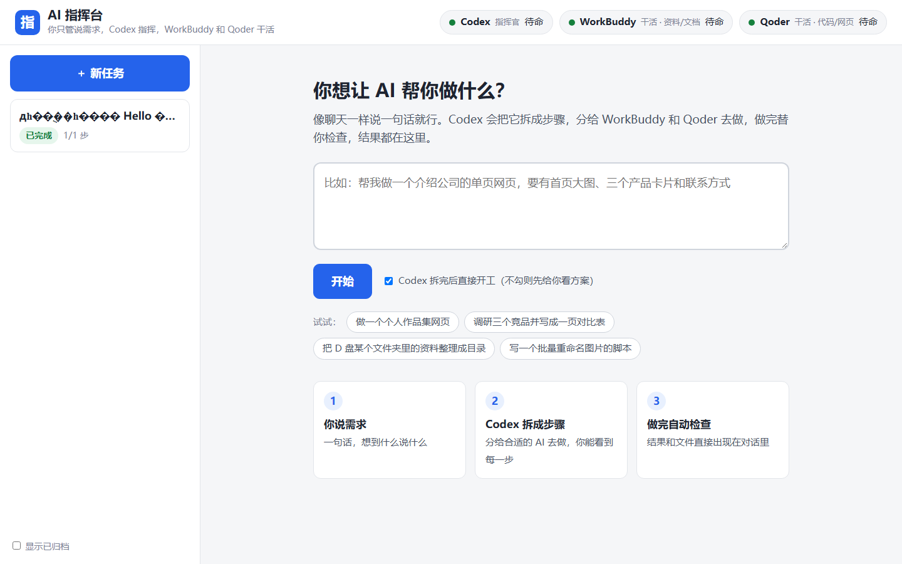
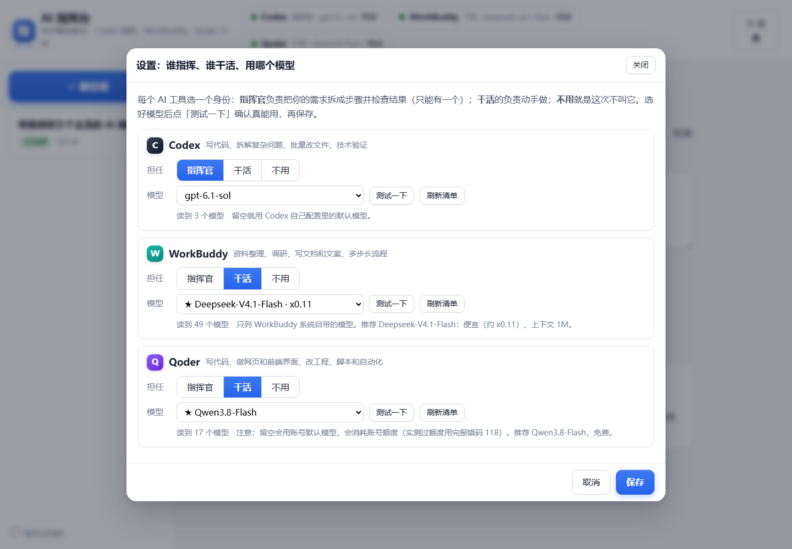

# AI 指挥台 · AI Console

> 你只管说需求，AI 们分工去做。

把 **Codex / WorkBuddy / Qoder / TraeWork / 豆包** 这些桌面 AI 工具编成一支团队：一个当指挥官负责拆单派活，其余当工人并行干活，**换一家做交叉验收**，结果自动汇总回一个网页工作台。

不用编排框架、不用向量库、不用 API Key 中转——**真相源就是一个文件夹**。

[](LICENSE)
[](https://bun.sh)

---

## 它解决什么问题

你手上大概率已经装了好几个 AI 工具。它们的真实状态是：

- **各干各的**：每个都要你重新讲一遍背景，讲完它就忘了。
- **没有交接**：A 做完了，你不知道 B 该从哪接。
- **没人验收**：AI 说"我做完了"，你打开一看是半成品——它自己验自己，永远通过。
- **不敢跑长活**：一口气丢个大任务进去，中间卡住了你也不知道卡在哪。

AI 指挥台把这件事变成一个**生产线**：你说一句目标 → 拆成任务卡 → 派给多个 AI 并行做 → 换一家验收 → 结果落盘汇总。

## 界面

| 工作台主界面 | 任务线程 |
|---|---|
|  |  |

| 新任务 | 设置：谁指挥、谁干活 |
|---|---|
|  |  |

---

## 核心机制：一份文件总线

**没有数据库、没有消息队列、没有中间服务。** 所有协作状态都编码在 `tasks/` 目录下的**文件名后缀**里。

```
T07.todo.md              待认领
T07.claimed.codex.md     我领了，正在干（租约，别的工具不许碰）
T07.waiting.md           已派给人工触发（等人粘贴口令）
T07.done.md              产出已就位，等验收
T07.review.md            正在被第三方验收
T07.pass.md              通过
T07.fail.md              不通过（附验收意见）
T07.human.md             需人工确认（自动重派已用尽）
```

改名 = 交接。这是整个系统最关键的一个设计选择：

- **改名是原子的**。操作系统保证要么成功、要么失败，不存在"两个 AI 同时领到同一张卡"。这比在文件里写 `status: claimed` 可靠得多——后者读完到写回之间总有窗口期。
- **抢不到就放弃**。`renameSync` 抛 `ENOENT/EPERM` 说明被别人抢了，工具直接跳过这张卡，不需要任何锁服务。
- **人可读**。你打开 `tasks/` 目录，一眼就能看出全局：谁在做、谁做完了、谁是卡住的。

### 三条铁律（写进 `AGENTS.md`，每次派工全文内联）

1. **只写自己的目录。** 你的身份由口令指定，只能写 `<ROOT>/<你的目录>/` 和点名的那一张卡。
2. **共享读，绝不共享写。** 你可以读任何目录，但写它 = 覆盖别人。
3. **禁改区**：协议本身、`config/`、`console/` 不许动。有意见写在卡的"验收结论"里。

### 交接兜底：DONE 文件

多数聊天型 App 会拒绝改别人目录里的文件。所以协议提供了一条更省事的替代路径：

> 不要碰 `tasks/`，只把产出写进 `<ROOT>/<你的目录>/<卡号>/`，写完后**在同一目录里新建一个空文件 `DONE`**。工作台轮询到这个标记，就替你完成改名和后续验收。

这条兜底**优先于**改卡名。它让"只能写自己目录"的沙箱工具也能参与，实测有效。

### 交叉验收：不许自己验自己

```
产出方  ──写产出──▶  <worker>/T07/
                          │
验收方  ◀──独立会话─────  reviews/T07.codex.md
        （新 thread、看不见产出过程、只对着"定义完成"逐条查）
```

验收口令明确要求：**只检查"定义完成"里的条款，不要重写内容**，按 `通过 / 不通过 / 需要人工确认` 三选一输出，并指出具体**文件与行号**。

当本机只有一家能无人值守执行时，系统会降级成"**同源独立会话**"（新 thread、cwd 相同、看不到产出过程），并在结论文件里如实标注 **"非跨家，可人工推翻"**——不假装是真交叉。

---

## 架构

```
                    ┌──────────────────────────────┐
   你：一句话目标 ──▶ │  指挥官（commander，L1）      │
                    │  拆成 N 张任务卡 + 依赖关系    │
                    └──────────────┬───────────────┘
                                   │ 写 tasks/*.todo.md
                    ┌──────────────▼───────────────┐
                    │      文件总线 tasks/          │
                    │   （后缀状态机 = 唯一真相源）  │
                    └──┬────────┬────────┬─────────┘
                       │        │        │
          ┌────────────▼─┐ ┌────▼─────┐ ┌▼──────────┐
          │ WorkBuddy    │ │ Qoder    │ │ TraeWork  │  ← L2 工人并行
          │ (L2, worker) │ │ (worker) │ │ (worker)  │
          └────────────┬─┘ └────┬─────┘ └┬──────────┘
                       │        │        │  产出 + DONE
                    ┌──▼────────▼────────▼─────────┐
                    │  验收方（永远 ≠ 产出方）       │
                    │  reviews/*.codex.md           │
                    └──────────────┬───────────────┘
                                   │ pass / fail / human
                    ┌──────────────▼───────────────┐
                    │  console/ 工作台（SSE 实时）  │
                    │  一个任务一个对话，结果推回你  │
                    └──────────────────────────────┘
```

**层级（tier）的含义**：

- **L1**：能无人值守执行，可自动开工、可当验收方。
- **L2**：需要人工触发一次（在工具里粘一下派工口令），或依赖运行器（runner）代跑。

`config/workers.json` 里给每个工具标注了 `tier`、`sandbox`、`runner`。**同一家的 tier 会随机器环境变化**——比如 Codex 在某些 Windows 环境下只有 `danger-full-access` 能落盘。

---

## 快速开始

### 前置

- [Bun](https://bun.sh) ≥ 1.3（服务端**零 npm 依赖**，只用 `node:fs` / `node:path` 和 Bun 内置的 `Bun.serve` / `Bun.spawn`）
- 至少一个 AI 工具的 CLI 或桌面端（Codex / WorkBuddy / Qoder 任一）

### 跑起来

```bash
git clone https://github.com/scrofied/ai-console.git
cd ai-console

# 1) 生成本机配置
cp config/workers.example.json config/workers.json
#    然后编辑 workers.json，把 <尖括号里的路径> 换成你本机实际的安装位置

# 2)（可选）设置各工具所需的 API Key 环境变量，例如：
#    CODEBUDDY_API_KEY=...        # 只放环境变量，不要写进 workers.json

# 3) 启动工作台
bun run console/server.ts
# → http://127.0.0.1:8787
```

打开浏览器，在输入框里说一句目标，例如：

> 帮我调研三个主流的 AI 编程助手，写成一页对比说明，再根据这份说明做一个好看的单页对比网页

工作台会：让指挥官拆单 → 派给不同工人 → 每步做完自动换一家验收 → 把产出文件直接列在对话里，点「查看」就能读，「打开位置」直接跳资源管理器。

### 自检（不依赖任何 AI 真开工）

验证文件总线与状态机本身是否工作：

```bash
bun run scripts/smoke.ts      # 需先启动 server
```

它做四件事：建卡 → 应进 `waiting`；取口令 → 应内联协议 + DONE 兜底；模拟交活 → 应推进到 `done/review`；校验租约 → 同一张卡不能被重复领。

---

## 目录结构

```
.
├── AGENTS.md                  总线协议（四条以上 AI 的唯一共同语言，每次派工全文内联）
├── config/
│   ├── workers.example.json   工人配置模板 ← 复制成 workers.json 再改
│   └── settings.json          页面右上角「设置」保存的运行时配置（谁指挥/谁干活/用哪个模型）
├── console/                   工作台（WorkBuddy/浏览器侧）
│   ├── server.ts              单进程 Bun 服务端：状态机 + 派工 + 验收 + SSE
│   ├── index.html             页面骨架
│   ├── core.js                状态与实时刷新（SSE）
│   ├── render.js              渲染：任务列表 / 对话线程 / 步骤卡
│   ├── actions.js             用户动作：新任务、补齐、重做、归档
│   ├── settings.js            设置面板
│   └── ui.css                 样式
├── templates/
│   └── task-card.md           任务卡模板（四字段工作单）
├── tasks/                     任务卡运行区（后缀即状态；不入库）
├── reviews/                   交叉验收结论（不入库）
├── shared/
│   ├── index.md               结果索引
│   └── daily-log.md           日报（不入库）
├── assets/                    已沉淀的可复用资产（模板、参数、素材规范）
├── examples/
│   └── stage-a-2026-10-05/    一次真实运行的原始证据（见下）
└── scripts/
    └── smoke.ts               总线自检
```

`codex/ workbuddy/ qoder/ traework/ doubao/` 是各家 AI 的**独占产出目录**，由你实际接入的工具决定，不进仓库。

---

## 一次真实运行（`examples/stage-a-2026-10-05/`）

这不是演示数据，是一次端到端实跑的原始记录：

> 一句话目标 → Codex 总指挥拆单 → 派单（L2 降级 / L1 自动开工）→ 真产出落盘 → 自动交叉验收 → pass

那个目录里保留了 `plan.json`（指挥官拆出的三张卡，含依赖）、`events.jsonl`（完整事件流）、以及真实的验收结论。README 里同时**如实列出了这次哪里不纯净**：

1. 有两张卡是人工直接判 pass 的（目的是先把依赖门控跑通），不是真的由 L2 工具干活；
2. 验收方与产出方是同一家（降级成同源独立会话，结论文件已标注"非跨家，可人工推翻"）；
3. 为跑通这次改掉的四个真 bug（schema 严格模式、依赖 key 名 vs 卡号、`pumpAuto` 不在心跳里、沙箱档位）也全部记录在案。

> 我们把这个例子连"哪里不纯净"一起放进来，是因为一个能跑的系统和一个"看起来能跑"的系统的差别，通常就在这几行。

---

## 与常见方案的区别

| | 常见做法 | AI 指挥台 |
|---|---|---|
| **协作状态** | 中心数据库 / 消息队列 / 编排框架 | **文件名后缀**（改名 = 交接，天然原子） |
| **依赖** | 框架 SDK、编排 DSL | **零依赖**，单进程 Bun + 一个文件夹 |
| **工具接入** | 需要各家的 API Key 与 SDK | **只要它能读写文件**——聊天型 App 走 DONE 兜底也能参与 |
| **验收** | 模型自评 / 用户肉眼 | **换一家独立会话**，按条款给 `文件:行号` 证据 |
| **可观测** | 去日志平台翻 | **打开 `tasks/` 目录就是全局状态** |
| **人的位置** | 在流程外等结果 | **在对话里随时插话**（"标题再短一点"） |

---

## 诚实的边界

我们不想把边界藏起来，因为**知道它不擅长什么，比知道它擅长什么更有用**：

- **不是无人值守的黑箱。** L2 工具仍需要你在它自己的界面里粘贴一次派工口令。真·全自动只对 L1 成立，且 L1 通常是权限最宽的那一档（代价见下条）。
- **权限很宽。** 本机实测中 Codex 在 Windows 下必须用 `danger-full-access` 才能落盘；执行与验收的 cwd 都必须是总线根目录，否则工具读不到 `AGENTS.md` / `shared/` / `assets/`。**这套东西会在你的真实文件系统上以最高权限跑 AI。** 请在能接受这个前提的机器上使用，并优先用独立工作目录。
- **验收质量受限于验收方。** 当只有一家 L1 时，交叉验收降级为同源独立会话，**结论偏保守、可被人工推翻**。真正的跨家验收需要至少两家能无人值守执行的工具。
- **强依赖"定义完成"写得好。** 验收只看卡里的"定义完成"条款。条款写得含糊，验收就只能给模糊结论。协议里因此反复强调：**写"不要什么"比写"要什么"更有效。**
- **同一家的 tier 会随机器变化。** 换机器请重新实测沙箱档位，别照抄配置。
- **不是生产级多租户系统。** 它是给一个人（或一个小团队）在自己的机器上指挥多家 AI 用的，鉴权、隔离、审计都不在本项目的目标内。

---

## English

**AI Console** turns your desktop AI tools (Codex / WorkBuddy / Qoder / TraeWork / Doubao) into a team: one commander breaks a goal into task cards, other tools execute in parallel, and a **third party cross-reviews** the output. Results stream back into a local web console.

The whole coordination layer is **a folder**. Task state lives in the **filename suffix** (`T07.todo.md` → `T07.claimed.codex.md` → `T07.done.md` → `T07.pass.md`). Renaming is atomic, so no database, no queue, no lock service, and no framework — just `bun run console/server.ts`.

- **Atomic handoff by rename.** Two agents can never claim the same card; the loser gets `ENOENT` and skips it.
- **DONE fallback.** Chat-style apps that can't rename files just write their output plus an empty `DONE` file in their own folder.
- **No self-review.** A different agent (ideally a different vendor) reviews against the card's checklist and cites `file:line`.
- **Zero npm dependencies.** Single Bun process using only `node:fs` / `node:path` and Bun built-ins.

Requires [Bun](https://bun.sh) ≥ 1.3. See **Quick start** above. MIT licensed.

---

## 协议全文

`AGENTS.md` 是这套系统的宪法，也是唯一权威定义：三条铁律、目录用途、状态机、四字段任务卡格式、交叉验收要求、开工前必读。**建议先读它**——它是这个项目真正的产品。

## License

[MIT](LICENSE) © 2026 scrofied
